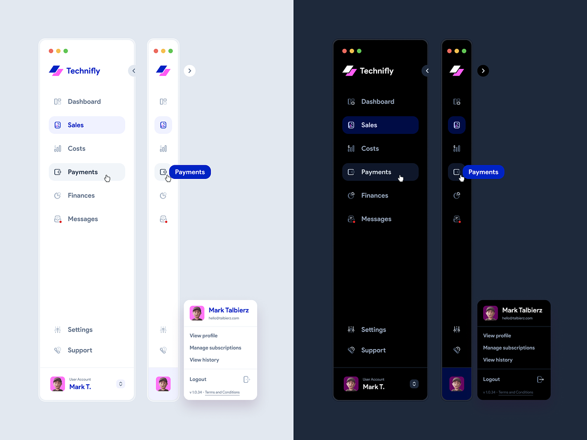

# Тестовое задание для компании «Makves group»

Ссылка на исходный репозиторий с заданием - [здесь](https://github.com/Alaladdin/frontend-html-task)

**Требования:**

Сверстать компонент `/src/components/Sidebar.jsx` по дизайну c использованием styled-components.

- В `/src/index.scss` есть дизайн-токены для светлой и темной темы.
- В зависимости от prop `color` Sidebar должен иметь стили темной или светлой темы.
- Сделать кнопку для переключения темы (стили на свое усмотрение).
- Возможность смены темы должна быть реализована в styled-components за счет дизайн-токенов.
- Нужна ссылка на развернутый вариант с готовой демонстрацией.
- Верстать нужно: лого, элементы навигации, `hover`, `active` состояния у элементов Sidebar, анимация при закрытии/открытии у элементов, которые скрываются/появляются.
- Верстать не нужно: тултипы, профиль, анимация при загрузке страницы (не открытие/закрытие).
- Дополнительно - иконки могут не соответствовать, это не так важно (больше всего интересует анимация при открытии/закрытии), логотип в проекте другой, используйте его.

**Реализация:**

1. Исходный предоставленный шаблон немного модернизирован - вместо `prop types` в проект был добавлен `typescript` как более современный подход к типизации кода. Таким образом, итоговый проект реализован на связке React + Typescript.
1. В процессе работы над проектом впервые был использован подход `css-in-js`, а именно `Styled Components`, а также освоена работа с дизайн-токенами.

